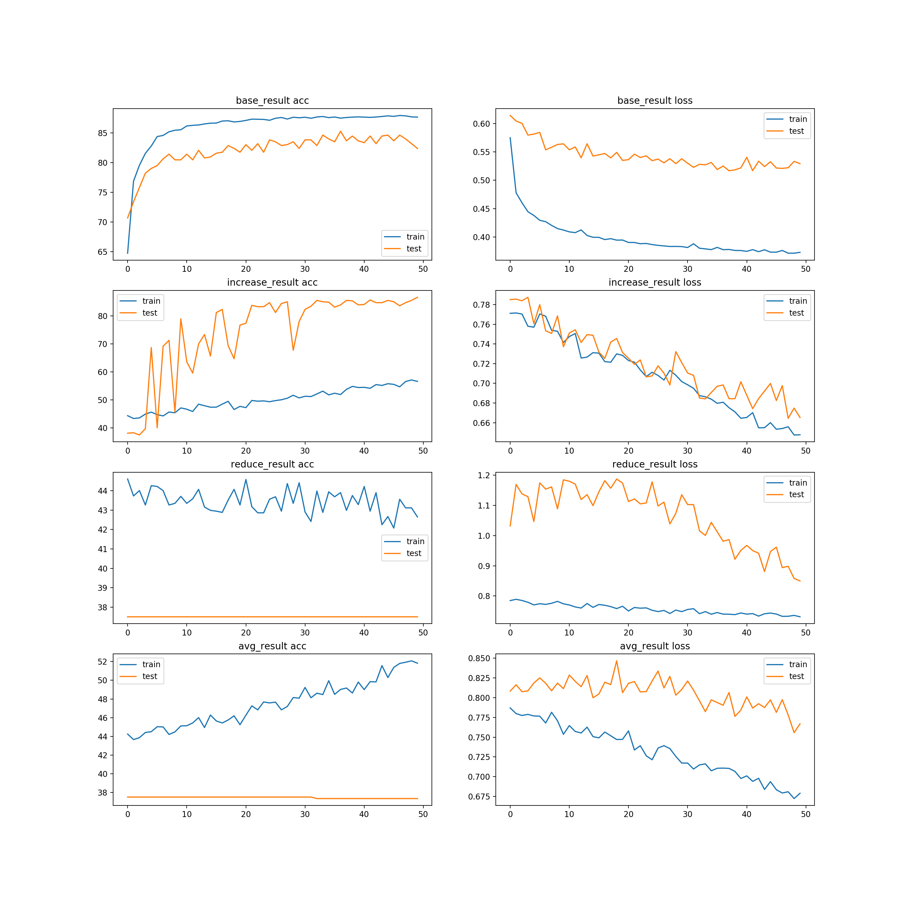
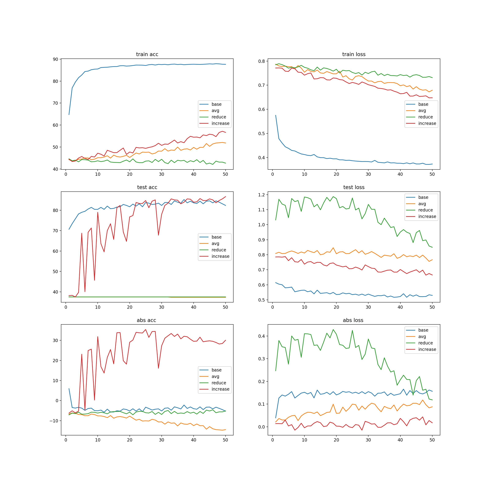
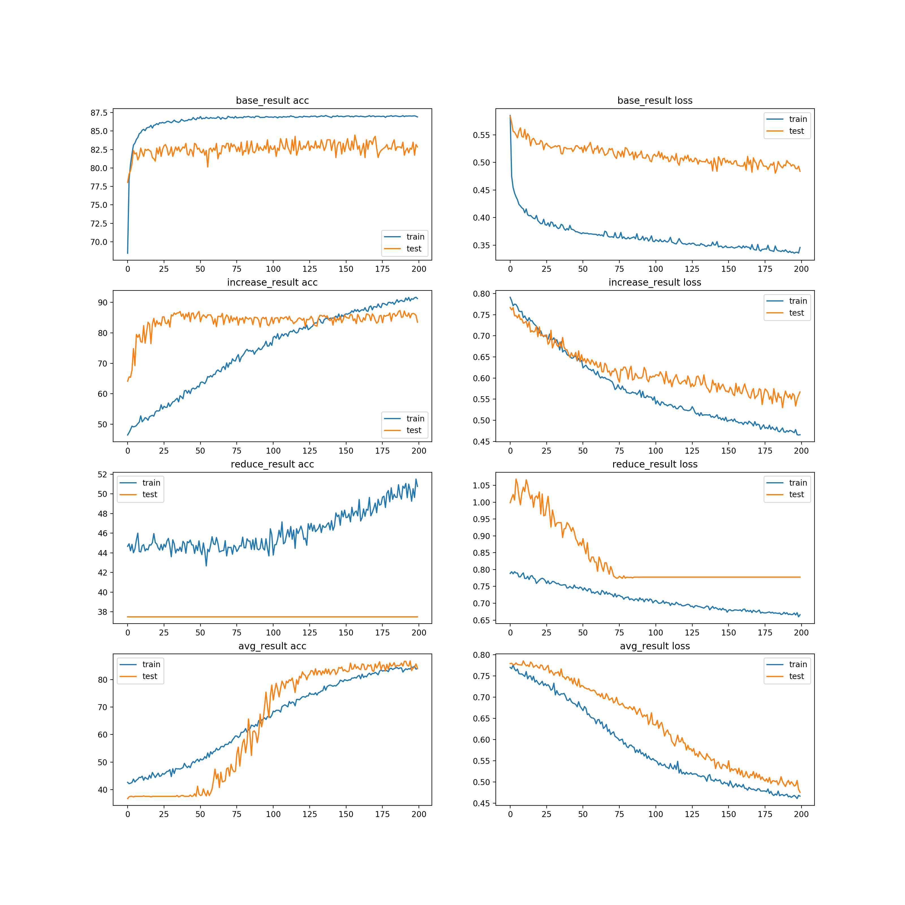
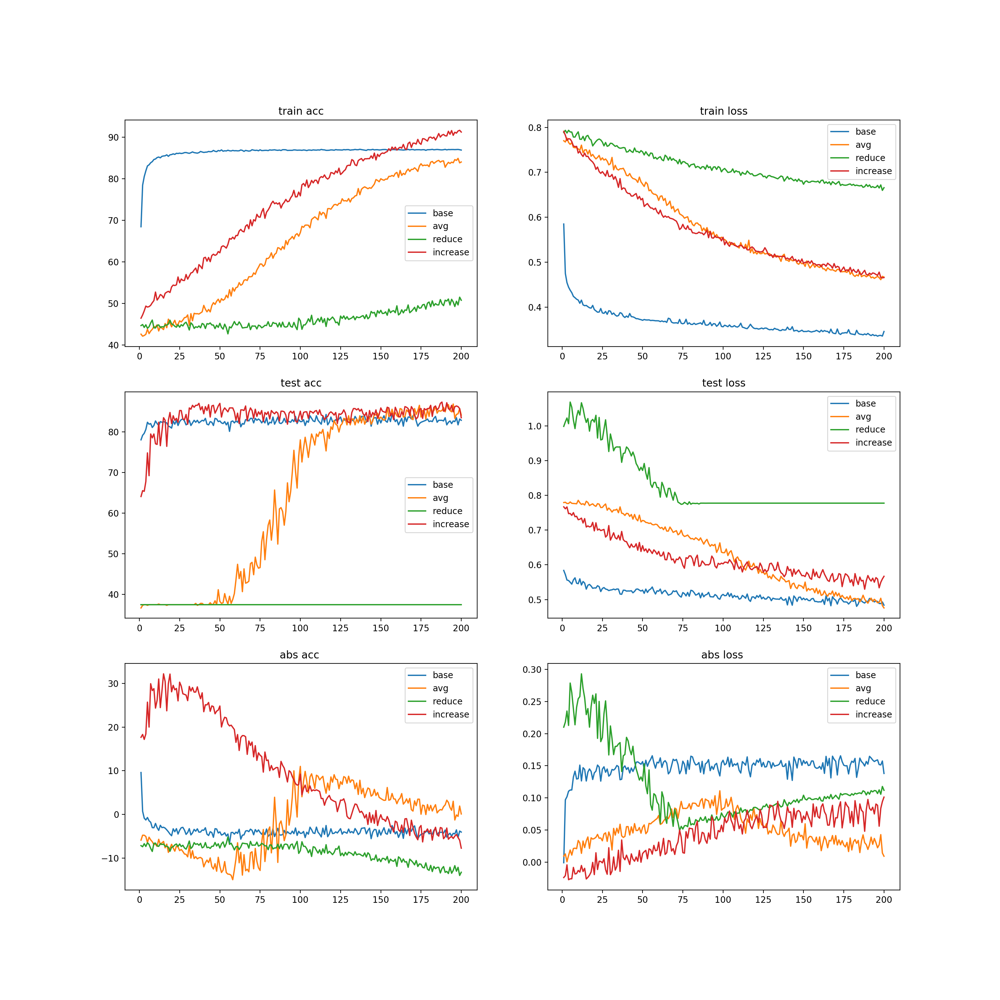

# Try Dropout experiment

In the project,  [PneumoniaMNIST](https://medmnist.github.io/) was used as dataset ,.The following experiments have been done. 

- The DNN was defined with six layers,you can find the defination in [config.py](./config.py)

Four experiments:

1. Base model is used  to overfit the dataset without dropout.
2. Increasing model is used to avoid overfit with droput in every layer .
   - dropout ->[0, 0.1, 0.3, 0.5, 0.7, 0.9]
3. Reduce model is used to avoid overfit with droput in every layer.
   - dropout ->[0.9, 0.7, 0.5, 0.3, 0.1, 0]
4. Avg model uses dropout in every layer, and all the dropout weights are the same.
   - dropout  ->[0.41,0.41,0.41,0.41,0.41,0.41]     2.5/6 <-->0.41

Result:
**epoch=50**

**epoch=200**

